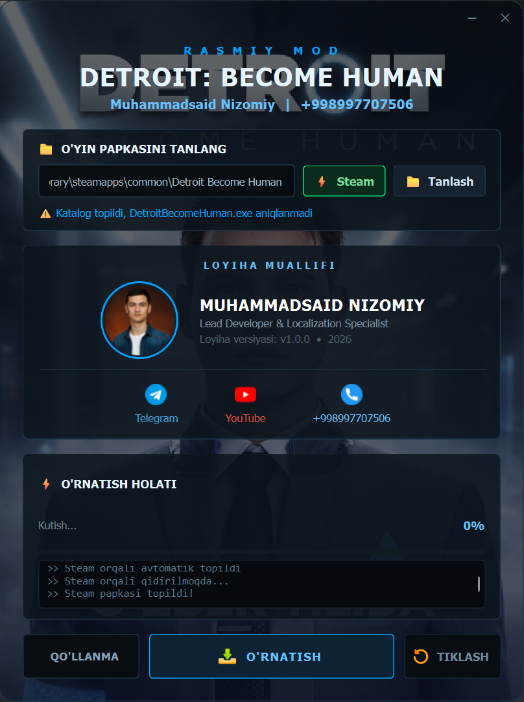

# Detroit: Become Human Uzbek Mod

An installer for the Uzbek localization of Detroit: Become Human.

## Features

- Uzbek localization
- Automatic Steam detection
- One-click installation
- Restore original files
- Modern installer interface

## Screenshots



## Requirements

- Windows 10/11
- Steam version

## Installation

Download the latest installer from the Releases section.

## Installation

Clone the repository:

```bash
git clone https://github.com/username/Detroit-Mod-Installer.git
```

Install dependencies:

```bash
pip install -r requirements.txt
```

Run:

```bash
python installer.py
```

## Author

Muhammadsaid Nizomiy